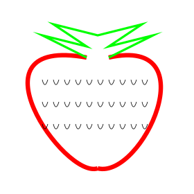

# strawberry
strawberry generating stuff for decorating letterheads or stationery

project description here: https://www.patreon.com/posts/17762004

I wanted to have some generative strawberries artfully scattered in an arc or line along the top of a sheet of paper as a letterhead or decoration for stationery. It would also be fun to be able to generate a pattern for printed fabric for dressmaking where the bottom of the fabric is more filled with strawberries than the top. I was hoping to make a generator for strawberries with python, but I think svgwrite (which I used in this example) is probably not the easiest or most fluid way of "drawing". The strawberries themselves should read as strawberries but be very sketchy like they were drawn. I also wanted the strawberries to be generative, somewhat in size and a bit in shape and have the leaves not all be uniform. They also should be positioned at different rotations. 

I also rewrote this code using pycairo instead of svgwrite, and pycairo seems to be a lot less cumbersome.

